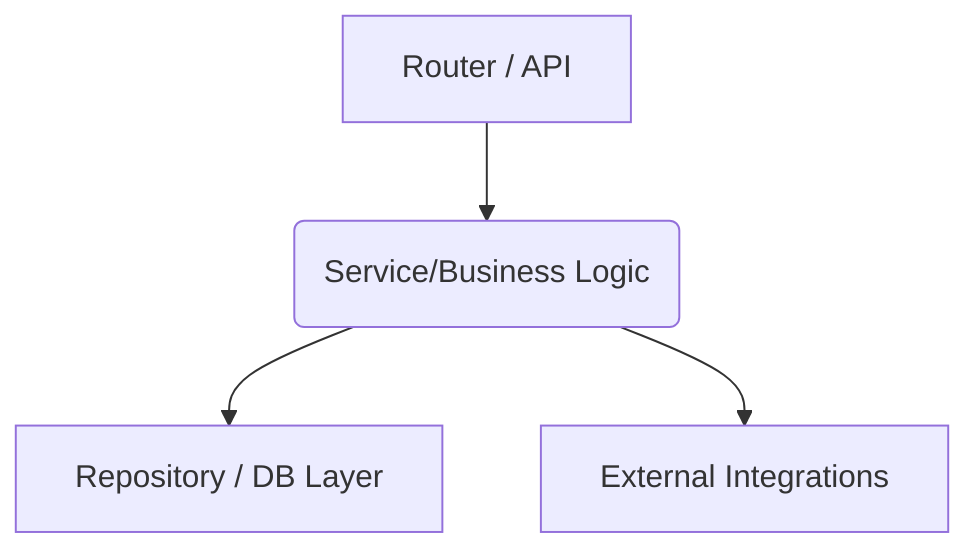

# Code-to-Graph Analysis

> "A graph is worth a thousand lines of code. Transform complex codebases into structured graphs to enhance agent comprehension."

## 1. Core Principles

| Principle | Why |
|-----------|-----|
| **Visual Architecture** | Agents can reason better when code is represented as nodes (files/functions) and edges (dependencies/calls). |
| **Top-Down Understanding** | Starts at entry points and traces execution flows (Call Graphs) or imports (Dependency Graphs). |
| **Context Minimization** | Instead of reading thousands of lines, read a concise representation (like Markdown graphs) to understand structure without wasting tokens. |

## 2. Tools & Implementation

Depending on the ecosystem, use these tools to extract graphs before analysis:

| Ecosystem | Tool | Purpose |
|-----------|------|---------|
| **JavaScript / TS** | `madge` | Analyzes and extracts module dependencies into graphs. |
| **Python** | `pydeps` | Extracts import relationships to find Python dependency chains. |
| **Go** | `go-callvis` | Visualizes the call stack and package dependencies in Go. |
| **Universal (AI)** | `Mermaid` | Standard format for AI agents to draw and perceive knowledge graphs within markdown. |

## 3. The Agent Workflow (Code → Graph → Understand)

When asked to analyze or debug a complex system, follow this sequence:

### Phase 1: Context Extraction (Code → Graph)
- **Do not read files linearly (alphabetically or arbitrarily).**
- Extract imports and exports from key entry points.
- Map out the relationships mentally, or explicitly write a `mermaid` diagram in a scratchpad artifact.

### Phase 2: Graph Perception (Understanding)
Use the mapped graph to identify:
- **Central Hubs:** Files with the most incoming/outgoing dependencies (High Fan-In / Fan-Out).
- **Orphaned Modules:** Code that is disconnected from the main graph.
- **Cycles:** Circular dependencies.

### Phase 3: Targeted Deep-Dive
- Pinpoint the exact module/function causing the issue based on the execution graph.
- Read only the necessary files.

## 4. Graph Example (Mermaid)

When generating context for yourself, use Mermaid to codify structure:

## 5. Anti-Patterns

| ❌ Don't | ✅ Do |
|----------|-------|
| Read all context linearly. | Traverse the system graph-first map. |
| Trust filenames for architecture logic. | Read `import`/`require` statements to prove connections. |
| Retain full raw file content in context. | Retain summarized edges and nodes of the architecture. |
