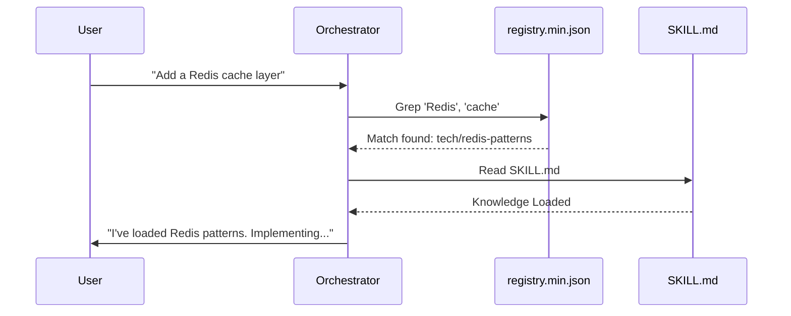
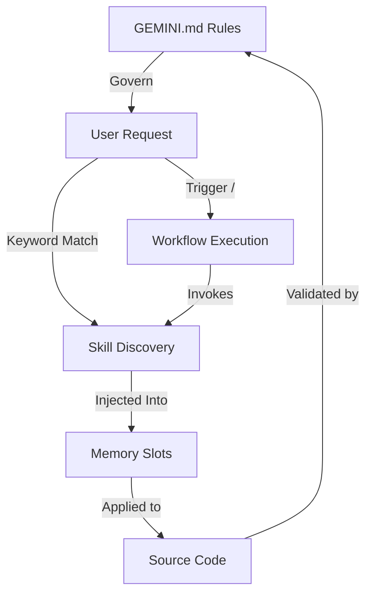

# The 3 Component Types

> Prompt Base is built on three distinct architectural pillars. Understanding how these layers interact is key to mastering the framework and maintaining token efficiency.

---

## 🏗️ Overview

Every project interaction in Prompt Base is governed by three component types, validated during system audits:

| Type | Target | Behavior | Activation |
|---|---|---|---|
| **1. Rules** | `GEMINI.md` | Persistent logic & governance | Always Active |
| **2. Workflows** | `antigravity/global_workflows/*.md` | Multi-step procedural logic | On-Demand (`/slash`) |
| **3. Skills** | `antigravity/skills/*/SKILL.md` | Specialized domain knowledge | Auto-Triggered (JIT) |

---

## 1. Rules (Tier 0 Logic)
**File:** `~/.gemini/GEMINI.md`

Rules are the "constitution" of the framework. They are injected into the system prompt of every single conversation, regardless of the task.

**What they cover:**
- **Coding Standards:** Language-agnostic principles (Clean Code, DRY, SOLID).
- **Process Governance:** The Socratic Gate, Request Classification logic.
- **Memory Management:** Slot Quotas and pruning instructions.
- **Security:** Hard constraints on credential handling and tool usage.

---

## 2. Workflows (On-Demand Orchestration)
**Path:** `~/.gemini/antigravity/global_workflows/`

Workflows are specialized "modes" that coordinate multiple specialist agents to execute complex, multi-step procedures. They are triggered explicitly by the user via slash commands.

**Lifecycle:**
1. **Trigger:** User types `/plan`, `/debug`, or `/create`.
2. **Setup:** The orchestrator loads the workflow markdown file.
3. **Execution:** The agent follows the step-by-step checklist defined in the workflow.
4. **Resolution:** The workflow ends when the final check is complete.

---

## 3. Skills (The Librarian Protocol)
**Path:** `~/.gemini/antigravity/skills/`

Skills are specialized knowledge packs. To maintain a "Minimal Viable Context" (MVC), Prompt Base never loads all skills at once. Instead, it uses the **Librarian Protocol** for Just-In-Time (JIT) loading.

### 🔍 How Skills are Discovered and Loaded

The discovery mechanism is a four-step cycle managed by the `orchestrator`:

#### Step 1: Intent Analysis
The agent analyzes your natural language request. It extracts "intent keywords" (e.g., "React", "caching", "deployment", "unit test").

#### Step 2: Registry Lookup
The orchestrator performs a fast search on `registry.min.json`. This flat file maps every skill's `description` to its file system `path`.

> [!NOTE]
> This is why the `description` field in a skill's frontmatter is critical. It must contain the keywords you want the AI to respond to.

#### Step 3: Context Injection (Loading)
Once a match is found, the **full content** of the skill's `SKILL.md` is loaded into a specific **Context Slot** (typically `SLOT_APP` or `SLOT_UX`).

#### Step 4: Selective Pruning (Unloading)
To prevent "Context Bleed" (where old instructions confuse the AI on new tasks), skills are **pruned** once their specific sub-task is finished.

- **Explicit Unload:** The agent triggers an `UNLOAD` command for the slot.
- **Quota Enforcement:** If a new skill needs a slot that is full, the oldest skill is evicted.

---

## 🔄 Interaction Diagram

## 🎯 Summary for Developers
- **Writing a New Feature?** Start with a **Workflow** to define the steps.
- **Adding Domain Knowledge?** Create a **Skill** with a rich description.
- **Changing Framework Behavior?** Update the **Rules** in `GEMINI.md`.
